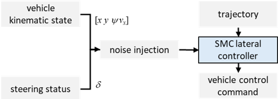
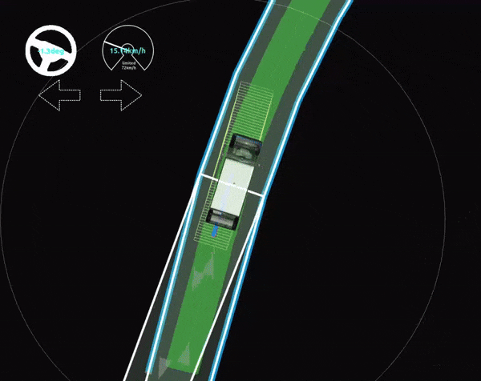
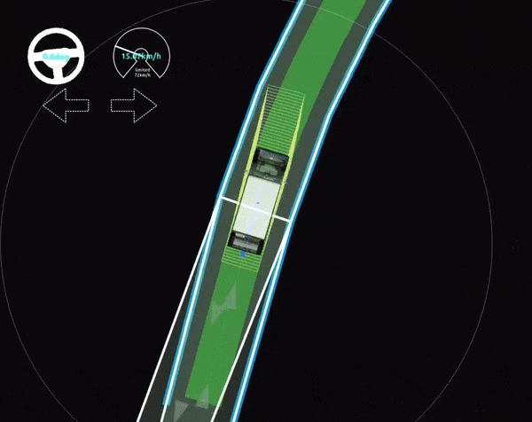

# SMC Lateral Controller

The smc lateral controller is based in the sliding mode control method for robust path tracking applications

## Purpose

This node is used to general lateral control commands (steering angle and steering rate) when tracking a path.

## Design

The SMC uses a model of the vehicle to simulate the trajectory resulting from the control command (in the same way as the MPC lateral controller does). An extended kinematic bicycle model without steering delays was tested and verified in simulations, however, the dynamic bicycle model considering slip angle, is available for testing and verification.

### Filtering

Filtering is required for good noise reduction. A Butterworth filter is used for the path curvature, and yaw and lateral errors used as input of the SMC.

## Known limits

The path tracking is not accurate in case of noisy data above of 0.32 m, 0.08 rad, 1.28 m/s, and 0.02 rad of standard deviation for the lateral error, yaw error, speed, and front steer angle measurements, respectively.

The SMC robustness was verified using `failure_injection` node (noise injection in the figure) to add noises around the measured data before feeding the `smc_lateral_controller` node:

An example of the performance of the robust SMC for resilient path tracking amid sensor interference is next:

| $\sigma_{xy}=0.16 m$ | $\sigma_{\psi}=0.04 rad$ |
| --------------- | --------------- |
|  |  |
| $\sigma_{vx}=0.64 m/s$ | $\sigma_{\delta}=0.02 rad$ |
|  |  |

### Inputs

The following (and others) can be set from the [controller_node](../trajectory_follower_node/README.md)

- `autoware_auto_planning_msgs/Trajectory` : reference trajectory to follow
- `nav_msgs/Odometry`: current odometry
- `autoware_auto_vehicle_msgs/SteeringReport` current steering

### Outputs

Return LateralOutput which contains the following to the controller node

- `autoware_auto_control_msgs/AckermannLateralCommand`
- LateralSyncData
  - steer angle convergence

### Parameter description

The default parameters defined in `config/smc_lateral_controller.param.yaml` are adjusted to the GEM e6 for under 40 km/h driving.

| Name                                         | Type   | Description                                                                                                                                          | Default value |
| :------------------------------------------- | :----- | :--------------------------------------------------------------------------------------------------------------------------------------------------- | :------------ |
| enable_path_smoothing | bool | smoothing flag. This should be true when uses path resampling to reduce resampling noise. | false |
| path_filter_moving_ave_num | int | number of data points moving average filter for path smoothing | 25 |
| traj_resample_dist | double | distance of waypoints in resampling | 0.1 |
| lambda | double | sliding surface error gain | 24.0 |
| alpha | double | super-twisting  error gain | 0.8 |
| beta | double | super-twisting derivative error gain | 0.04 |
| gamma | double | variable boundary layer gain | 1.0 |
| n_pred |  int | lateral/yaw error prediction | 24 |
| decay_factor | double | decay factor of steering command at zero speed | 0.9 |
| converged_steer_rad | double | steering angle threshold for convergence | 0.1 |
| lpf_cutoff_hz | double | cutoff frequency of lowpass filter | 1.0 |
| vehicle_model_type | string | vehicle model type for prediction. options are kinematic, and dynamic |

##### For dynamics model (WIP)

| Name          | Type   | Description                                 | Default value |
| :------------ | :----- | :------------------------------------------ | :------------ |
| mass_fl       | double | mass applied to front left tire [kg]        | 600           |
| mass_fr       | double | mass applied to front right tire [kg]       | 600           |
| mass_rl       | double | mass applied to rear left tire [kg]         | 600           |
| mass_rr       | double | mass applied to rear right tire [kg]        | 600           |
| cf            | double | front cornering power [N/rad]               | 155494.663    |
| cr            | double | rear cornering power [N/rad]                | 155494.663    |